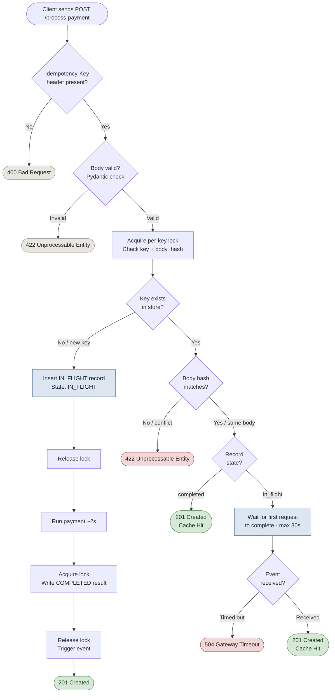
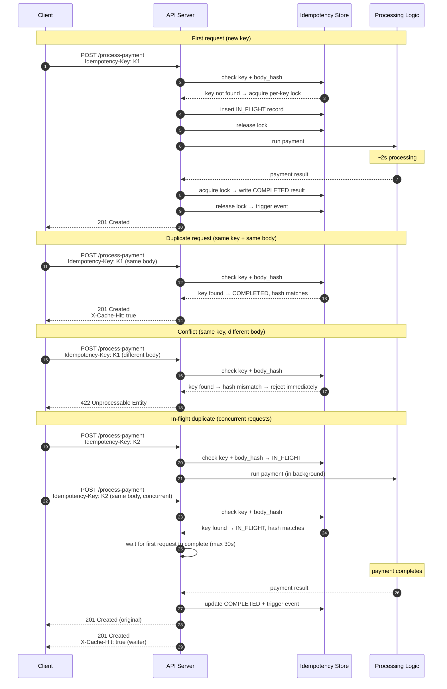

# Idempotency Gateway

Payment middleware that ensures a transaction runs **at most once per process instance**, no matter how many times the client retries.

Built for **FinSafe Transactions Ltd.** to stop double-charging caused by client-side retries on network timeouts.

---

## The Problem

Client sends a payment request. Network lags. Client retries. Both hit the server, both get processed, customer is charged twice.

The fix: every request carries a client-generated `Idempotency-Key`. The server uses that key to detect duplicates and return a cached result instead of processing again.

> **Single-process only.** The locks and events here are in-memory. Running multiple workers (`gunicorn -w 4`, Kubernetes replicas) without a shared store breaks the guarantee — each worker has its own memory. Redis is the production answer. See Limitations.

---

## Architecture

### Request flow



The payment engine is called exactly once per key — only on the first request. Every other path is a cache hit or a rejection.

### Concurrency

The race to prevent: two concurrent requests for the same new key both read "not found" and both start processing.

Per-key locks fix this without blocking unrelated payments. A thin meta-lock handles Lock object creation. Neither lock is held during the actual payment call.

### Sequence diagram



Result is written before event fires — any waiter that wakes up sees a complete record.

### Project layout

```
├── app/
│   ├── config.py     tuneable constants
│   ├── models.py     Pydantic models + IdempotencyRecord dataclass
│   ├── store.py      in-memory store, locking
│   ├── service.py    idempotency routing + payment simulation
│   ├── routes.py     HTTP handlers
│   └── main.py       app factory, background expiry task
├── tests/
│   └── test_api.py
├── requirements.txt
└── .gitignore
```

---

## Setup

Python 3.11+.

```bash
git clone <your-fork-url>
cd Idempotency-Gateway
pip install -r requirements.txt
make start
```

Or without make:

```bash
uvicorn app.main:app --port 8000
```

Interactive docs at `http://localhost:8000/docs`.

```bash
make test
# or: pytest tests/ -v
```

---

## API

### POST /process-payment

Headers:

| Header | Notes |
|---|---|
| `Idempotency-Key` | required — unique string per payment (UUID recommended) |
| `Content-Type: application/json` | required |

Body:
```json
{ "amount": 100, "currency": "GHS" }
```

`amount` must be > 0. `currency` is a 3-letter ISO 4217 code.

Responses:

| Status | When |
|---|---|
| 201 | first request processed, or duplicate replayed |
| 400 | Idempotency-Key missing or blank |
| 422 | bad body, or key reused with a different payload |
| 504 | waiting for an in-flight request timed out |

Replayed responses include `X-Cache-Hit: true`.

Both the original and duplicate get back `201` — same status, same body, same `transaction_id`. That way the client doesn't need to special-case retries.

`422` rather than `409`: this is a request-body consistency problem, not a resource state conflict. The spec allows either; `422` is the more accurate fit.

`504` only means the waiting client gave up. The original request keeps running. If it finishes, the next retry gets a normal `201`.

Success body:
```json
{
  "status": "success",
  "message": "Charged 100 GHS",
  "transaction_id": "f47ac10b-58cc-4372-a567-0e02b2c3d479"
}
```

### GET /health

Not in the spec. Returns `{"status": "ok", "store_size": N}`.

---

## Examples

First request:
```bash
curl -X POST http://localhost:8000/process-payment \
  -H "Content-Type: application/json" \
  -H "Idempotency-Key: 550e8400-e29b-41d4-a716-446655440000" \
  -d '{"amount": 100, "currency": "GHS"}'
```

Same request again (safe retry — comes back instantly with X-Cache-Hit: true):
```bash
curl -X POST http://localhost:8000/process-payment \
  -H "Content-Type: application/json" \
  -H "Idempotency-Key: 550e8400-e29b-41d4-a716-446655440000" \
  -d '{"amount": 100, "currency": "GHS"}'
```

Conflict (same key, different amount):
```bash
curl -X POST http://localhost:8000/process-payment \
  -H "Content-Type: application/json" \
  -H "Idempotency-Key: 550e8400-e29b-41d4-a716-446655440000" \
  -d '{"amount": 500, "currency": "GHS"}'
# → 422
```

Two concurrent requests with the same key:
```bash
curl -s -X POST http://localhost:8000/process-payment \
  -H "Idempotency-Key: concurrent-001" \
  -H "Content-Type: application/json" \
  -d '{"amount": 200, "currency": "USD"}' &

curl -s -X POST http://localhost:8000/process-payment \
  -H "Idempotency-Key: concurrent-001" \
  -H "Content-Type: application/json" \
  -d '{"amount": 200, "currency": "USD"}' &

wait
# Both return 201, same transaction_id, one has X-Cache-Hit: true
```

---

## Tests

```bash
pytest tests/ -v
```

| Test | What it covers |
|---|---|
| `test_first_request_is_processed` | new key, payment runs, 201 back |
| `test_duplicate_returns_cached_response` | same key+body, cached response, X-Cache-Hit, engine called once |
| `test_different_body_same_key_returns_422` | key reused with different amount → 422 |
| `test_concurrent_duplicates_process_once` | two simultaneous requests, one waits, both get 201 with same body |
| `test_missing_header_returns_400` | no header → 400 |
| `test_negative_amount_returns_422` | Pydantic rejects bad input before idempotency logic runs |
| `test_missing_currency_returns_422` | same |
| `test_conflict_during_in_flight_returns_422_immediately` | conflicting body mid-flight → 422 without waiting |
| `test_different_keys_run_concurrently` | different keys finish in ~1× delay, not 2× |
| `test_evict_expired_removes_old_completed_records` | old completed keys are cleaned up |
| `test_evict_expired_skips_in_flight_records` | in-flight keys are never touched by the sweep |

Concurrency tests use real async sleeps so the actual lock and event paths run.

---

## Design notes

The most interesting decision is the locking. The naive approach — one global lock around the entire check-then-set — works but means a payment for key "abc" blocks while key "xyz" is being looked up, for no reason. Per-key locks remove that unnecessary coupling.

The `asyncio.Event` on each record acts as a wake signal, not a data channel. When the first request finishes it calls `event.set()`, which unblocks all waiters at once. Data is always written under the key lock before the event fires, so there's no window where a waiter reads a half-written record.

The conflict check (different body, same key) runs before the event wait. If we waited first and returned the cached result, a caller asking about a completely different payment would get back the wrong response. Checking body hash first makes that impossible.

Both success and failure outcomes are cached as terminal. Retrying a key that already failed returns the same error without hitting the payment engine again. This matters for partially-executed payments — you don't want a failed charge to be retried as if it never happened.

---

## Developer's choice — key expiry

Without it the store is a memory leak. A background task runs every 5 minutes and removes completed keys older than 1 hour. The TTL is tunable in `config.py` (Stripe uses 24 hours in production).

`IN_FLIGHT` records are excluded from eviction. Removing one while the first request is still running would strand all waiting duplicates — the event would never fire and they'd block until timeout. The sweep acquires each key's lock individually before deleting to avoid racing with `complete()`.

---

## Limitations

In-memory means none of this survives a restart. If the process crashes, all records are gone. Any in-flight requests were processing at the time become unresolvable — their waiting callers will hit the 504 timeout.

There's also a narrow window: if the process crashes after the payment runs but before `complete()` writes the result, the payment happened but there's no record of it. The next retry would have no way to know without external reconciliation.

For production you'd want:

- Redis with `SET NX PX` — atomic set-if-not-exists, TTL handled natively, survives restarts, shared across workers
- Leased in-flight state — model ownership as a short TTL key; if the worker dies, the lease expires and the next request can safely take over
- Redis pub/sub — replaces `asyncio.Event` across process boundaries so replicas can wake each other up
- PostgreSQL or DynamoDB — audit trail for every transaction, needed for anything regulated

The store interface in `store.py` is kept simple on purpose — swapping the backend means rewriting one file.

---

## Production at a glance

| | Now | Production |
|---|---|---|
| Durability | gone on restart | Redis + PostgreSQL |
| Multiple workers | breaks | shared Redis |
| Cross-process wakeup | n/a | Redis pub/sub |
| TTL management | background sweep | Redis native expiry |
| Auth | none | API key or mTLS |